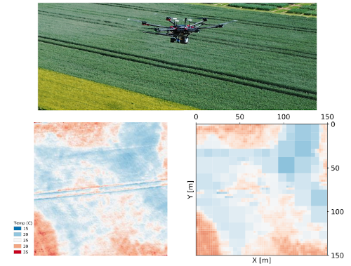

# Adaptive-Resolution Field Mapping Using Gaussian Process Fusion with Integral Kernels

Liren Jin<sup>1</sup>, Julius Rückin<sup>1</sup>, Stefan H. Kiss<sup>2</sup>, Teresa Vidal-Calleja<sup>2</sup>, Marija Popovic<sup>1</sup><br>

<sup>1</sup> University of Bonn, <sup>2</sup> University of Technology Sydney

This repository contains the implementation of our paper "Adaptive-Resolution Field Mapping Using Gaussian Process Fusion with Integral Kernels" accepted by RA-L + IROS2022.

  

## Environment Setup
```commandline
git clone git@github.com:dmar-bonn/argpf_mapping.git
cd argpf_mapping
conda env create -f environment.yaml
conda activate argpf_mapping
```
## Mapping Experiment
```commandline
python main.py -E mapping
```
## Planning Experiment
```commandline
python main.py -E planning
```
## Maintainer
Liren Jin, ljin@uni-bonn.de
## Citation
```commandline
@ARTICLE{9797797,
  author={Jin, Liren and Rückin, Julius and Kiss, Stefan H. and Vidal-Calleja, Teresa and Popović, Marija},
  journal={IEEE Robotics and Automation Letters}, 
  title={Adaptive-Resolution Field Mapping Using Gaussian Process Fusion With Integral Kernels}, 
  year={2022},
  volume={7},
  number={3},
  pages={7471-7478},
  doi={10.1109/LRA.2022.3183797}}
```

## Project Funding
This work has been fully funded by the Deutsche Forschungsgemeinschaft (DFG, German Research Foundation) under Germany’s Excellence Strategy, EXC-2070 – 390732324 (PhenoRob)

